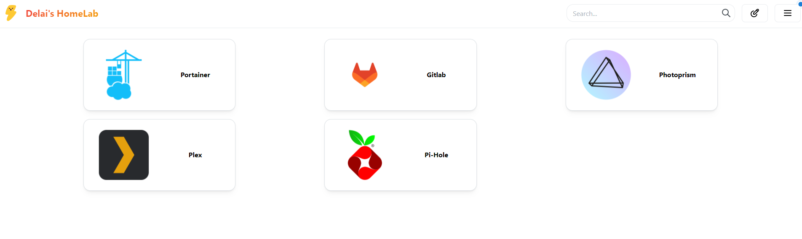

# Homelab

Tenho um laptop antigo e queria dar um novo uso para ele, instalei Ubuntu Server como sua distribuição e Samba para conseguir compartilhar arquivos do meu PC principal para ele (Windows -> Linux), mantendo como um backup de arquivos. Assim posso acessar todos os arquivos do servidor em todos os dispositivos da minha rede, através do protocolo SMB/CIFS.
.  
Além disso, instalei Docker no servidor para conseguir rodar alguns serviços:
 
.
🐙 GitLab: Com o objetivo de aprender mais sobre CI/CD, o Gitlab me pareceu um serviço excelente para ter rodando no servidor.  
🚫 Pi-hole: Para bloquear anúncios em toda rede, utilizei o Pi-hole como solução de DNS, adeus propagandas!  
📷 PhotoPrism: Como meu Google Fotos já está com 80% de uso, decidi usar o Photoprism como alternativa, assim consigo acessar em todos meus dispositivos todas minhas fotos e meus vídeos.   
📺 Plex: Séries e filmes também precisavam de um local, por isso utilizei o plex como Media Center.   
🐳 Portainer: Para conseguir administrar todos os containers e imagens utilizei o portainer, que tem uma interface gráfica muito linda e amigável.   
📆 Homarr: O Homarr utilizei como dashboard para conseguir acessar todos os serviços, já que, não estava conseguindo decorar as portas de todos na hora de acessar.   

  

